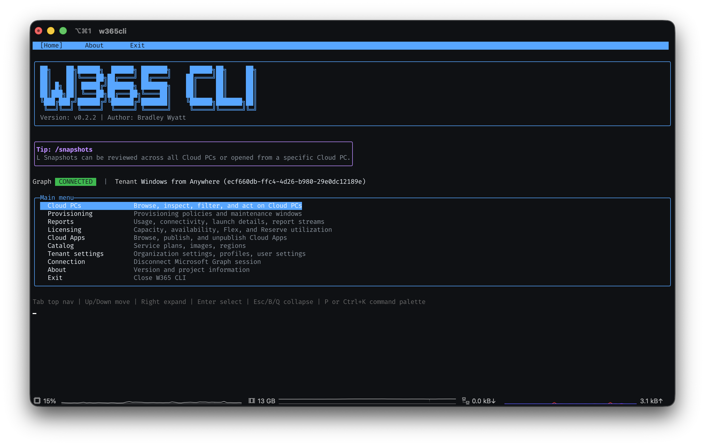
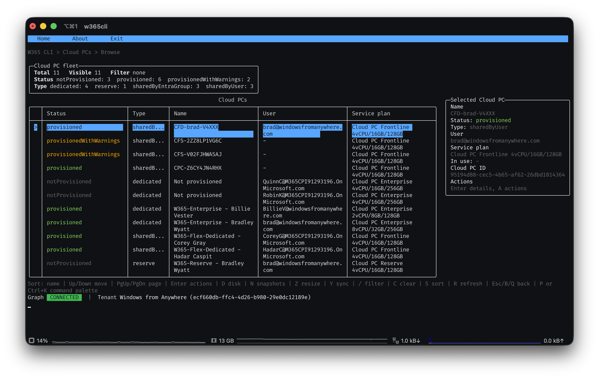
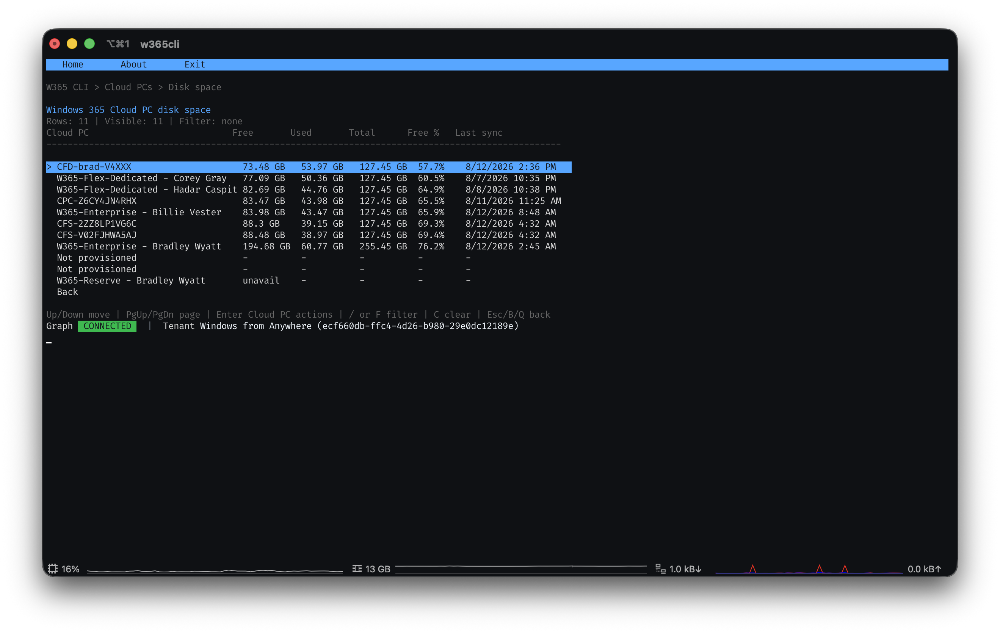
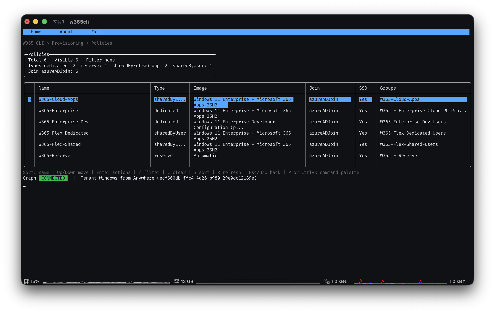
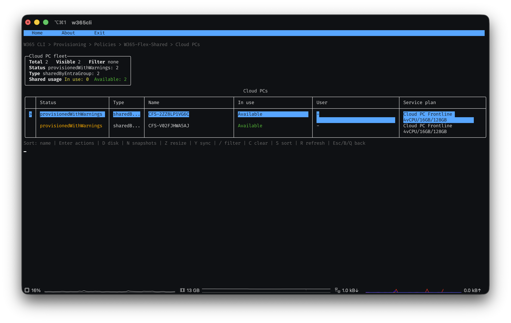
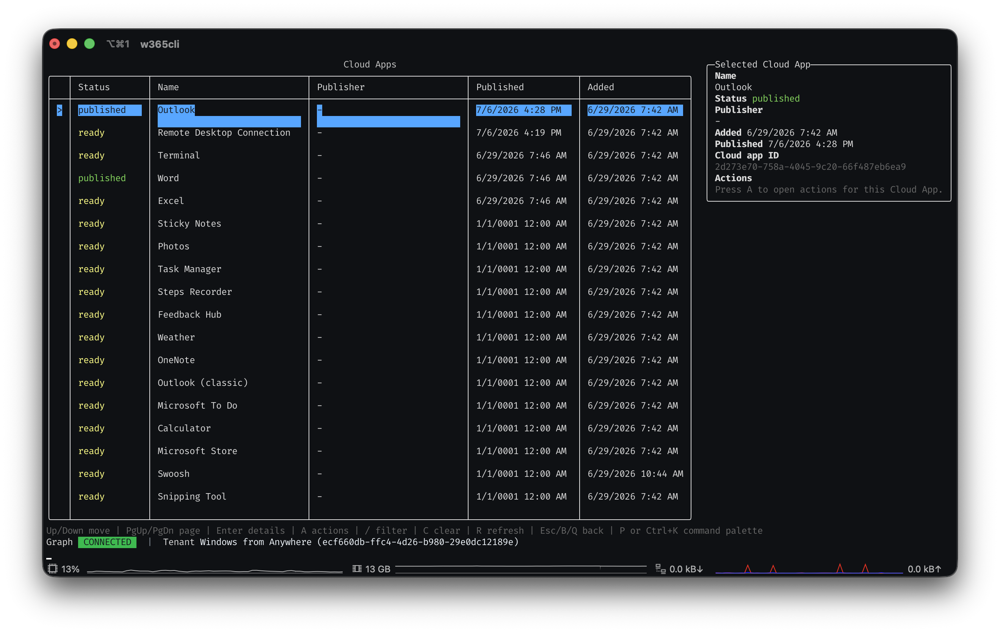
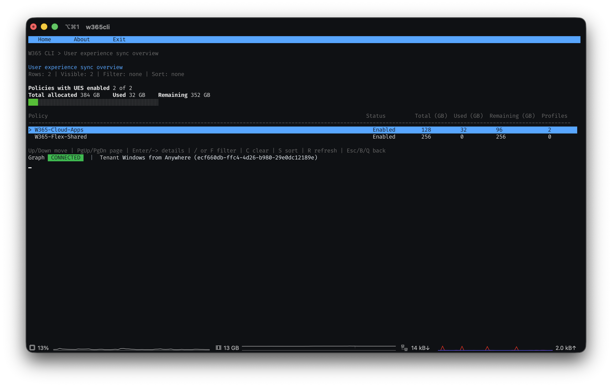

# W365 CLI

[](https://github.com/bwya77/W365-CLI-Native/actions/workflows/ci.yml)
[](https://github.com/bwya77/W365-CLI-Native/actions/workflows/codeql.yml)
[](https://github.com/bwya77/W365-CLI-Native/actions/workflows/release.yml)
[](https://github.com/bwya77/W365-CLI-Native/releases/latest)
[](LICENSE)
[](https://dotnet.microsoft.com/download/dotnet/8.0)
[](https://github.com/bwya77/W365-CLI-Native/releases)

<p align="center">
  
</p>

<details>
<summary><strong>More screenshots</strong></summary>
<br>

| | |
|---|---|
|  |  |
| Browse and filter your Cloud PC fleet | Inspect disk space and snapshots |
|  |  |
| Browse provisioning policies | View the Cloud PCs assigned to a policy |
|  |  |
| Browse and publish Cloud Apps | Manage user experience sync storage and profiles |

</details>


W365 CLI is a keyboard-first Windows 365 Cloud PC management experience built as a .NET
command-line app.

It is separate from the PowerShell-based `W365CLI` module and does not require the PowerShell module at runtime.

## What it does

- Browse, filter, sort, and inspect Cloud PCs.
- Browse Cloud PCs scoped to a Flex shared-pool provisioning policy, including how many users
  share access to each pool.
- Run Cloud PC actions such as sync, restart, resize, rename, reprovision, power on,
  reset local admin password, and end grace period.
- View disk space (with a color-coded usage bar), snapshots, and remote action history.
- Create, restore, and delete snapshots.
- View detailed status information (including provisioning warnings/errors, real-time sign-in
  status, and "in use" state) for a Cloud PC.
- Browse provisioning policies and view the Cloud PCs assigned to a policy.
- Create a new provisioning policy from scratch, including Windows 365 Flex Dedicated and Flex
  Shared with real-time license capacity validation.
- Export, copy, reprovision, and delete provisioning policies.
- Reprovision a shared policy's Cloud PCs while keeping a reserve percentage available.
- View and manage user experience sync (user settings persistence) storage and profiles for
  shared provisioning policies, including a tenant-wide overview across all policies.
- View and manage the members of a provisioning policy's assigned Entra group, including which
  members currently have a Cloud PC provisioned.
- Understand Windows 365 license capacity, availability, and Flex utilization.
- Browse a full set of Cloud PC reports - sign-in status, connectivity/connection-quality
  history, disk space, launch details, action status, performance trends, and Windows 365 Flex
  license usage (hourly, daily, and real-time) - each rendered with report-specific columns.
- Export a Markdown snapshot of your Cloud PC inventory, provisioning policies, and licensing for
  sharing or archiving.
- Browse Cloud Apps and publish or unpublish them.
- Browse service plans, gallery images, custom images, and supported regions.
- View tenant settings, setting profiles, and user settings.
- Check GitHub Releases for newer builds and install updates automatically.

## Install

### Windows (recommended: installer)

One-line install (no admin/UAC prompt - installs to `%LocalAppData%\Programs\W365CLI` and adds it
to your user PATH):

```powershell
irm https://raw.githubusercontent.com/bwya77/W365-CLI-Native/main/install.ps1 | iex
```

Open a new terminal and type `w365cli` to get started. The installer also registers a normal
uninstaller under **Settings > Apps** (or **Control Panel > Programs and Features**), so you can
remove it like any other application - or run:

```powershell
irm https://raw.githubusercontent.com/bwya77/W365-CLI-Native/main/uninstall.ps1 | iex
```

Alternatively, download `W365CLISetup-<version>-win-x64.exe` or `-win-arm64.exe` from the
[latest release](https://github.com/bwya77/W365-CLI-Native/releases/latest) and run it directly.

### macOS (recommended: install script)

One-line install (no `sudo` required - installs to `~/.local/bin/w365cli` and adds it to your
PATH):

```bash
curl -fsSL https://raw.githubusercontent.com/bwya77/W365-CLI-Native/main/install.sh | bash
```

Open a new terminal and type `w365cli` to get started. To uninstall:

```bash
curl -fsSL https://raw.githubusercontent.com/bwya77/W365-CLI-Native/main/uninstall.sh | bash
```

Add `--purge-path` to also remove the PATH line the installer added to your shell profile
(`~/.zshrc` or `~/.bash_profile`).

### Linux (recommended: install script)

Same one-line install script as macOS - it detects the OS and architecture automatically (no
`sudo` required - installs to `~/.local/bin/w365cli` and adds it to your PATH):

```bash
curl -fsSL https://raw.githubusercontent.com/bwya77/W365-CLI-Native/main/install.sh | bash
```

Open a new terminal and type `w365cli` to get started. To uninstall:

```bash
curl -fsSL https://raw.githubusercontent.com/bwya77/W365-CLI-Native/main/uninstall.sh | bash
```

Add `--purge-path` to also remove the PATH line the installer added to your shell profile
(`~/.bashrc`, `~/.zshrc`, or `~/.profile`).

### Portable (no install)

Download the latest release:

```text
https://github.com/bwya77/W365-CLI-Native/releases/latest
```

Download the package for your platform, extract it, and run the binary:

| Platform | Asset | Binary |
| --- | --- | --- |
| Windows x64 | `w365-win-x64.zip` | `W365Cli.exe` |
| Windows ARM64 | `w365-win-arm64.zip` | `W365Cli.exe` |
| macOS Intel | `w365-osx-x64.zip` | `W365Cli` |
| macOS Apple Silicon | `w365-osx-arm64.zip` | `W365Cli` |
| Linux x64 | `w365-linux-x64.tar.gz` | `W365Cli` |
| Linux ARM64 | `w365-linux-arm64.tar.gz` | `W365Cli` |

On macOS, the MSAL token cache is stored with Keychain protection. On Linux, it's stored via the
system keyring (GNOME Keyring/KWallet through libsecret) when one is available; if no keyring
daemon is running (common on headless servers/minimal containers), it falls back to a plain,
user-only-readable file instead of failing sign-in.

If you extract a portable package instead of using an installer/install script, add the
extracted folder to your PATH manually if you want to launch the CLI from any terminal.

## Sign in

The CLI uses Microsoft Graph delegated permissions and an interactive browser sign-in. After the
first successful sign-in, MSAL keeps a persistent token cache so you usually do not need to sign in
every run.

On startup, the CLI tries to silently restore the cached Microsoft Graph session. If no cached session exists, open:

```text
Connection > Connect
```

## Permissions

W365 CLI ships with a built-in, multi-tenant Entra app registration - there's nothing to set up
or register yourself. The first time you connect from a new tenant, if the required permissions
haven't been consented to yet, the CLI detects that automatically and offers to open the admin
consent page for you; a Global Admin (or Privileged Role Admin) approves it once, and you're set.

The built-in app ID is:

```text
9d497858-c200-402c-a363-279a5800d730
```

It's configured as a public client ("Mobile and desktop applications" platform in Entra) with a
`http://localhost` redirect URI, and requests these delegated Microsoft Graph permissions:

```text
CloudPC.ReadWrite.All
DeviceManagementManagedDevices.Read.All
DeviceManagementManagedDevices.PrivilegedOperations.All
Group.Read.All
GroupMember.ReadWrite.All
User.Read.All
Organization.Read.All
offline_access
openid
profile
email
```

`GroupMember.ReadWrite.All` is required for the "Manage group members" feature (add/remove
members of a provisioning policy's assigned Entra group). `User.Read.All` is used to search the
directory when adding a member. If you only need read-only features, `Group.Read.All` alone is
enough and `GroupMember.ReadWrite.All` can be omitted from the consent grant.

### Running your own app registration instead

If you'd rather not use the built-in multi-tenant app (for example, to scope permissions
yourself or run fully isolated within a single tenant), you can point the CLI at your own app
registration:

```powershell
$env:W365CLI_CLIENT_ID = '<client-id>'
$env:W365CLI_TENANT_ID = '<tenant-id>'
```

Your app registration needs the same public client configuration and permissions listed above.

## Security & trust

W365 CLI only ever acts with the permissions of the signed-in user (delegated Graph access) - it
has no standing access to your tenant of its own, and nothing in the binary is secret. Release
builds are produced entirely by this repository's own GitHub Actions workflows (nothing is
built or uploaded by hand), are checked for vulnerabilities on every push via CodeQL, and are
signed (Windows: Azure Trusted Signing; macOS: Apple Developer ID + notarization) with published
`SHA256SUMS-*.txt` checksums for every platform. See [SECURITY.md](SECURITY.md) for the full
security policy, exactly what the CLI can access, and how to report a vulnerability.

## Navigation

The CLI is designed for keyboard use.

| Key | Action |
| --- | --- |
| `Up` / `Down` | Move selection |
| `PgUp` / `PgDn` | Page through long tables |
| `Enter` | Open the selected row or run the selected action |
| `/` or `F` | Filter a table |
| `C` | Clear the current filter |
| `S` | Cycle table sort modes where available |
| `R` | Refresh data where available |
| `Esc`, `B`, or `Q` | Go back |
| `P` or `Ctrl+K` | Open command palette |
| `H` | Open in-session action history |

Action submissions show a brief result screen, then return to the previous page.

## Main areas

### Cloud PCs

The Cloud PCs area includes:

- Browse Cloud PCs
- By shared pool - browse the Cloud PCs and member count of a specific Flex shared-pool
  provisioning policy
- Disk space across all Cloud PCs
- Snapshots across all Cloud PCs

Selecting a Cloud PC opens its detail page with actions and subviews for disk space, snapshots,
resize, and remote action history.

### Provisioning

The Provisioning area includes a provisioning policy browser with actions to:

- View Cloud PCs assigned to a policy
- Export policy JSON
- Create a policy copy
- Reprovision Cloud PCs assigned to the policy
- Reprovision a shared policy while keeping a reserve percentage available, and check status
- View user experience sync storage usage and profiles for shared-by-Entra-group policies
- Manage the members of a policy's assigned Entra group (view, add, remove), including which
  members currently have a Cloud PC
- Delete a policy

It also includes a "Create policy" wizard - with Windows 365 Flex Dedicated and Flex Shared
license capacity validated against real tenant data before you submit - and a tenant-wide "User
experience sync overview" that rolls up storage usage across every shared-by-Entra-group policy.

### Reports

Reports include:

- Sign-in status
- Connectivity history (per Cloud PC)
- Disk space
- User experience sync
- Launch details
- Cloud PC Usage Category Report
- Daily Connection Quality Report
- Flex License Daily/Hourly/Real-Time Usage Reports
- Flex User Connections Report
- Inaccessible Cloud PC Report
- Performance Trend Report
- Regional Connection Quality Report
- Sign-In Activity Summary Report

Where possible, selecting a Cloud PC row opens that Cloud PC's detail page; report rows with data
that only exists on the report itself open a full field-detail view instead.

### Licensing

Licensing summarizes Windows 365 subscribed SKU capacity against the current Cloud PC inventory.
It shows purchased licenses, assigned licenses, provisioned Cloud PCs, estimated availability,
Reserve Cloud PC usage, and Windows 365 Flex dedicated/shared utilization.

For Flex, the CLI shows the 3:1 dedicated provisioning model and the active-session limit. It also
shows provisioning policies and groups that grant access where Graph exposes assignment data.

### Catalog

Catalog includes:

- Service plans
- Gallery images
- Custom images
- Supported regions

### Tenant settings

Tenant settings includes:

- Organization settings
- Setting profiles
- User settings

### Cloud Apps

Cloud Apps includes browse, publish, and unpublish workflows.

### Export

Export generates a single Markdown snapshot of your tenant - Cloud PC inventory (with status/type
breakdowns), provisioning policies, and Windows 365 licensing - for sharing or archiving outside
the CLI. It's read-only and makes no changes to your tenant.

## Updates

W365 CLI checks GitHub Releases on startup and offers to update automatically when a newer
version is available:

- **Windows** - downloads the matching installer and, if you agree, runs it silently
  (`/VERYSILENT /NORESTART`); W365 CLI closes for a few seconds while it updates, then reopen it.
  If you'd rather update later, the installer is saved locally and you can double-click it anytime.
- **macOS and Linux** - downloads the matching build and replaces the installed `w365cli` binary
  in place (an atomic rename, safe even while it's running). The new version is used the next
  time you quit and reopen `w365cli`.

Release builds are published as GitHub Release assets:

```text
W365CLISetup-<version>-win-x64.exe
W365CLISetup-<version>-win-arm64.exe
w365-win-x64.zip
w365-win-arm64.zip
w365-osx-x64.zip
w365-osx-arm64.zip
w365-linux-x64.tar.gz
w365-linux-arm64.tar.gz
SHA256SUMS-windows.txt
SHA256SUMS-macos.txt
SHA256SUMS-linux.txt
```

Windows release binaries and installers are signed with Azure Trusted Signing before packaging.
macOS release binaries are signed and notarized when the Apple Developer signing secrets are
available. Linux release binaries are not signed (no equivalent code-signing convention for
Linux CLI binaries); verify integrity with `SHA256SUMS-linux.txt` if desired.

## Development

Prerequisite:

```text
.NET 8 SDK
```

Build:

```powershell
dotnet build --configuration Release
```

Run:

```powershell
dotnet run --project .\src\W365Cli\W365Cli.csproj
```

Publish a local self-contained Windows x64 binary:

```powershell
dotnet publish .\src\W365Cli\W365Cli.csproj -c Release -r win-x64 --self-contained true -p:PublishSingleFile=true -p:PublishTrimmed=false -o .\artifacts\publish\win-x64
```

Other release runtime identifiers:

```text
win-arm64
osx-x64
osx-arm64
```

Create a release:

```powershell
git tag v0.2.0
git push origin v0.2.0
```
